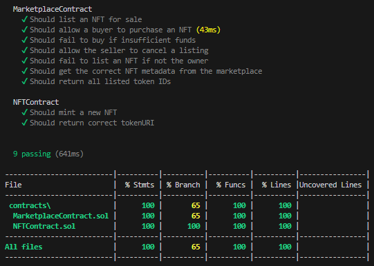

# NFT Marketplace Project

## Objectives and motivation

The primary objective of this project is to develop a decentralized NFT marketplace where users can mint, list, and trade NFTs seamlessly. The motivation behind this project stems from the growing popularity of NFTs and the need for a user-friendly platform that facilitates the creation and exchange of digital assets. By utilizing smart contracts on the Ethereum blockchain, we aim to ensure transparency, security, and ownership for users participating in the NFT ecosystem.

## Smart Contracts

### NFTContract

- **mintNFT(address to, string calldata _tokenURI)**: This function allows the owner of the contract to mint a new NFT with a specified URI. It increments the token ID for each minted NFT and assigns it to the specified address.
  
- **tokenURI(uint256 tokenId)**: This function retrieves the metadata URI associated with a specific NFT.

### MarketplaceContract

- **mintNFT(string calldata _tokenURI)**: This function allows the marketplace to mint a new NFT through the `NFTContract`, which ensures that only the marketplace can mint NFTs.
  
- **listItem(uint256 tokenId, uint256 price)**: This function allows the owner of an NFT to list it for sale on the marketplace at a specified price.

- **buyItem(uint256 tokenId)**: This function allows users to purchase an NFT from the marketplace. It checks if the item is for sale and if sufficient funds have been provided.

- **cancelListing(uint256 tokenId)**: This function allows the seller to cancel a listing before it has been purchased.

- **getAllListedTokenIds()**: This function returns an array of all listed token IDs, allowing users to view the available NFTs for sale.

- **getListing(uint256 tokenId)**: This function retrieves the details of a specific listing, including the price and seller.

- **getNFTMetadata(uint256 tokenId)**: This function retrieves the metadata for a specific NFT from the `NFTContract`.

### Compilation

To compile the smart contracts, run the following command in your terminal:

```bash
npm run compile
```


### Running Tests
The project includes a comprehensive suite of tests to ensure that all functionalities, such as minting, listing, buying, and canceling NFTs, are working as expected. The tests cover a range of edge cases and expected behaviors.

To run the test suite, simply use the following command:

```bash
npm run test
```
This will execute all the unit tests to verify the correct behavior of the smart contracts.

### Test Coverage
To generate a coverage report, which shows the percentage of code that is tested, you can use the following command:

```bash
npm run coverage
```
This will create a detailed report indicating how much of the smart contract code is covered by the tests. The report can be found in the coverage directory.



### Deployment

To deploy the contracts to the desired network, use the following command:

```bash
npm run deploy --network ethereum_sepolia_testnet
```

You can use any other network (e.g., `ethereum_sepolia_testnet`, `binance_bsc_testnet`, etc.). Please check [hardhat.config.ts](./hardhat.config.ts) to see the options.

NFTContract deployed to: `0xd89d7C7532dB68722c7fA9918aE772598e344714`
MarketplaceContract deployed to: `0x2EE1A83E9969Ad3b2FfF5e42003089bE48Ac9354`

### Verification

```bash
$ npx hardhat verify --network ethereum_sepolia_testnet 0xd89d7C7532dB68722c7fA9918aE772598e344714
```
Successfully verified contract NFTContract on the block explorer.
https://sepolia.etherscan.io/address/0xd89d7C7532dB68722c7fA9918aE772598e344714#code


```bash
$ npx hardhat verify --network ethereum_sepolia_testnet 0x2EE1A83E9969Ad3b2FfF5e42003089bE48Ac9354 0xd89d7C7532dB68722c7fA9918aE772598e344714
```

Successfully verified contract MarketplaceContract on the block explorer.
https://sepolia.etherscan.io/address/0x2EE1A83E9969Ad3b2FfF5e42003089bE48Ac9354#code

### Block Explorer Links

- [NFTContract on Etherscan](https://sepolia.etherscan.io/address/0xd89d7C7532dB68722c7fA9918aE772598e344714)
- [MarketplaceContract on Etherscan](https://sepolia.etherscan.io/address/0x2ee1a83e9969ad3b2fff5e42003089be48ac9354)

### Transactions and function executions

1. **Minting an NFT**:
   - Transaction Hash: [0x2408e45c5d77288d08c4c2f9cf479a44851d587afa4f42156187fd7882074eed](https://sepolia.etherscan.io/tx/0x2408e45c5d77288d08c4c2f9cf479a44851d587afa4f42156187fd7882074eed)

2. **Listing an NFT**:
   - Transaction Hash: [0x456798b79559c6c7741798a2ae357f182083eff4d283e8ef879721c3f93559d0](https://sepolia.etherscan.io/tx/0x456798b79559c6c7741798a2ae357f182083eff4d283e8ef879721c3f93559d0)

3. **Purchasing an NFT**:
   - Transaction Hash: [0x1e38fee490ce6dd4edcb36cca307540cda391a9ff74c6605d988a2b17859f7db](https://sepolia.etherscan.io/tx/0x1e38fee490ce6dd4edcb36cca307540cda391a9ff74c6605d988a2b17859f7db)

4. **Canceling a Listing**:
   - Transaction Hash: [0x17b0adbdb60012fc3976c758cc62a29c42abed19b74a78157ddb5a945e5020ff](https://sepolia.etherscan.io/tx/0x17b0adbdb60012fc3976c758cc62a29c42abed19b74a78157ddb5a945e5020ff)
